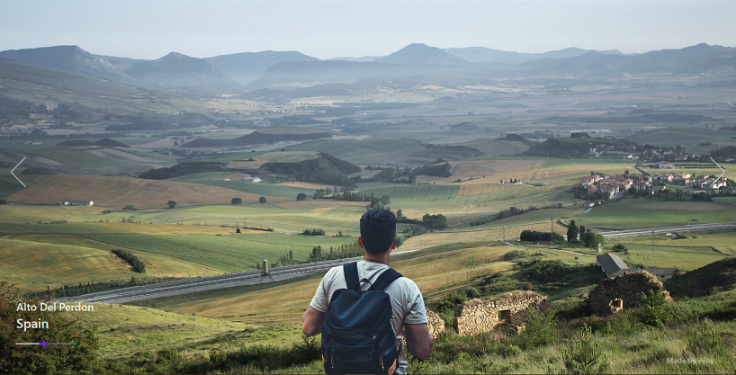

# Go-Places

Built with React, Vite, TypeScript and Framer Motion :heart:

## Screenshots

## Live

Live deploy: [https://goplaces.vercel.app/]

## Run Locally

To run the site locally,

1. Clone this repository.
2. Open terminal in project folder, then run
   `npm install`
   `npm run dev`
